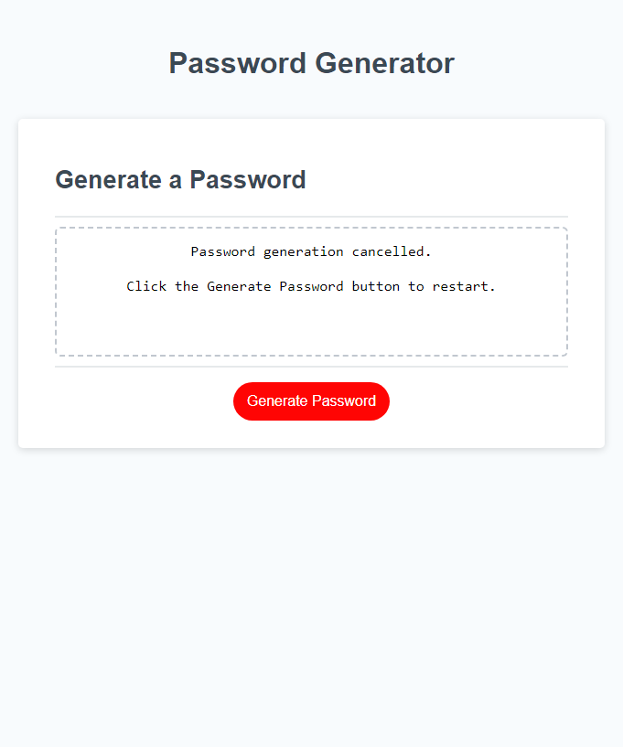

# Password Generateor Javascript Build

## Description
The password generator is intended to provide users with an easy method of generating randomly created passwords based on input. This project utilized existing HTML and CSS code with a functional JS button. My task was to write the remaining JS code to prompt the user for input, validate the input, and utilize the input to generate a password. This task was to help strengthen and build on the basics of JavaScript and programming logic.

The generation process should request input from the user with a series of prompts. Since a user can input any value or lack of value the code must validate and accept only appropriate input for the requested input. The code should also consider that a user may cancel or [ESC] the whole process and display an appropriate message. Upon successfully gathering the required input the generated password will be written to the site in the provided text box.

Deployed Project: https://decourtney.github.io/112822-Javascript-Password-Generator/

 
    
  
          
    

 

## Installation

N/A

## Usage

The site contains a single red Generate Password button and a readonly text box were the resulting password is displayed. A user clicks the button and is then presented with a series of prompts asking for certain inputs. At any point the user can hit their ESC key or click a cancel button to exit the generation process. 

The first prompt asks for a number within a displayed range and will continue to display error pop-ups until the user enters an acceptable number. 

Next the user is presented with a series of 4 prompts asking the user what type of characters are to be used in the password generation. The prompts are looking for a 'y' or 'n' input. The generator will accept any input that begins with either character until each prompt has an acceptable answer. The generator also requires the user to select at least one character type.

## Credits

N/A

## License

MIT License

Copyright (c) 2022 decourtney

Permission is hereby granted, free of charge, to any person obtaining a copy
of this software and associated documentation files (the "Software"), to deal
in the Software without restriction, including without limitation the rights
to use, copy, modify, merge, publish, distribute, sublicense, and/or sell
copies of the Software, and to permit persons to whom the Software is
furnished to do so, subject to the following conditions:

The above copyright notice and this permission notice shall be included in all
copies or substantial portions of the Software.

THE SOFTWARE IS PROVIDED "AS IS", WITHOUT WARRANTY OF ANY KIND, EXPRESS OR
IMPLIED, INCLUDING BUT NOT LIMITED TO THE WARRANTIES OF MERCHANTABILITY,
FITNESS FOR A PARTICULAR PURPOSE AND NONINFRINGEMENT. IN NO EVENT SHALL THE
AUTHORS OR COPYRIGHT HOLDERS BE LIABLE FOR ANY CLAIM, DAMAGES OR OTHER
LIABILITY, WHETHER IN AN ACTION OF CONTRACT, TORT OR OTHERWISE, ARISING FROM,
OUT OF OR IN CONNECTION WITH THE SOFTWARE OR THE USE OR OTHER DEALINGS IN THE
SOFTWARE.